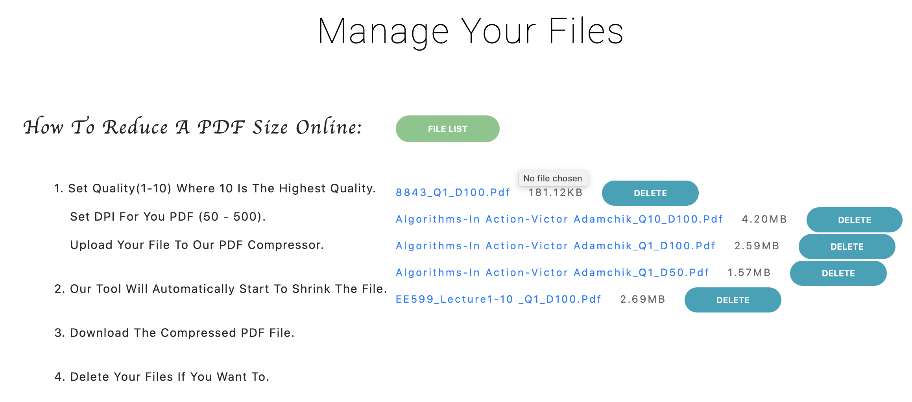
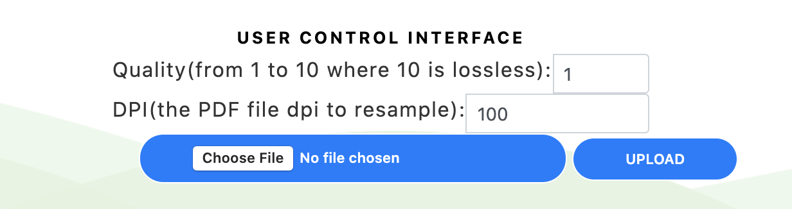
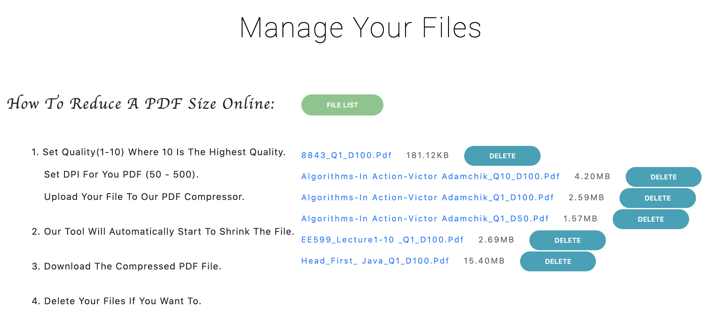
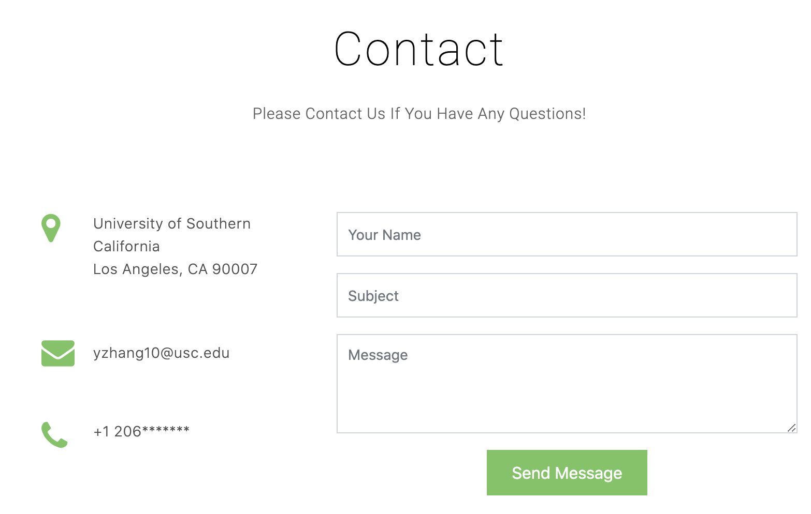

# Node.js-express-for-PDF-compactor (file-management)

## Tools

* frontend: Bootstrap4 + HTML + jQuery+ CSS
* backend: Node.js + express
* PDF Optimizer API : [PDFtron](https://www.pdftron.com/documentation/mac/get-started/nodejs/).

## Functions

* User can set Quality and DPI to get different compressed size.

  Quality: from 1 to 10 where 10 is lossless.
  There is an example:
  | Quality | DPI | Original zise | compressed size |
  | :------ |:---- | :-----------: | :-------------:|
  | 1       | 100  | 8.9MB         |    2.59MB      |
  | 10      | 100  | 8.9MB         |    4.20MB      |
  | 1       | 50   | 8.9MB         |    1.57MB      |

* Store the uploaded files in our own (NodeJS or Python) server.
* compact the PDF from large size to small size.
* Implement API endpoints to a file list, user can download, and remove files for user.


* can send email to producer. use [nodemailer](https://nodemailer.com/message/).
* can support English and Chinese.
* show the total Web Hit.

## Getting started

To get the Node server running locally:

- Clone this repo
- to install all required dependencies
```bash
$ npm install
```
- to install PDFtron,you can learn more in [PDFtron](https://www.pdftron.com/documentation/mac/get-started/nodejs/).

```bash
$ npm install @pdftron/pdfnet-node
```
- go to /frontend, then run

```bash
$ node app.js
```

## More
This project is for USC EE599 project. :blush:





